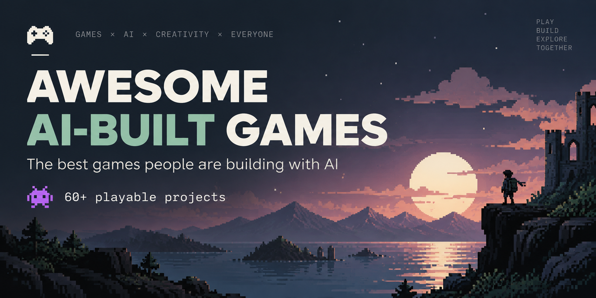

# Awesome AI-Built Games 

A curated list of vibe-coded games: playable games built with AI coding agents like Claude Code, Cursor, Codex, GPT, Gemini, Grok and Lovable. AI wrote most of each game's code, and every one is playable right now, most in the browser.

**Built a game with AI?** [Submit it here](https://github.com/lappemic/awesome-ai-built-games/issues/new?template=submit-game.yml), no pull request needed.

> For more projects and tools, visit [michaelscheiwiller.com](https://michaelscheiwiller.com)

## Contents

- [Games](#games)
  - [Action & Shooters](#action--shooters)
  - [Racing & Vehicles](#racing--vehicles)
  - [Adventure & Open Worlds](#adventure--open-worlds)
  - [Simulation & Strategy](#simulation--strategy)
  - [Puzzle, Word & Trivia](#puzzle-word--trivia)
  - [Arcade & Retro](#arcade--retro)
- [Tools & Frameworks](#tools--frameworks)
- [Directories](#directories)

## Games

### Action & Shooters

- [AI Bomber Game](https://bomberman-bice.vercel.app/) - Bomberman-style 3D arena where you drop bombs to clear crates and enemies, with switchable bomb types. Built with Three.js.
- [ClaudeSpace](https://ladegeraet.github.io/claudespace/) - Top-down space shooter with shields and shockwaves against asteroids and enemy ships. Built with Phaser.
- [CSAnyWhere](https://csany.vercel.app) - Counter-Strike-style shooter with aim drills, spray practice and a Dust II bot deathmatch. Built with Three.js.
- [DOOMscroll](https://gisnep.com/doomscroll/) - Doom-style shooter you control only by scrolling, with real news headlines on the in-game plaques. Built with GPT-5 · HTML5 Canvas.
- [Dyson Defender](https://dyson-defender.vercel.app/) - Fly around a Dyson sphere and shoot down waves of alien ships before they reach it. Built with Cursor, Claude, Grok, gptme · Three.js.
- [Eyrie](https://playeyrie.com/) - Drop-in co-op wave roguelike where you catch spirits, feed the shrine and fight the obelisk. Vibe Jam 2026 Most Atmospheric award. Built with Three.js.
- [FragByte](https://www.fragbyte.fun/) - Valorant-inspired arena shooter against enemy waves, with a katana parry and a grappling hook. Built with Three.js.
- [KÖTTBULLAR METAL](https://kottbullar-metal.vercel.app/) - Survive 15 minutes in a mosh pit where the death metal lyrics are IKEA product names. Vibe Jam 2026 Funniest Game award. Built with HTML5 Canvas.
- [Null Range](https://nullrange.com/) - Multiplayer first-person space dogfights inspired by Elite: Dangerous, with sonar, boost and lasers. Vibe Jam 2026 Best Art Direction award. Built with Cursor · Three.js.
- [Quasar Saz](https://github.com/cleak/quasar-saz/releases/tag/v1.1) - Six-stage action game with a boss fight that Claude Code designed from a dog's random keystrokes. Built with Claude Code · Godot.
- [Swingers](https://swing.offmylawn.com/) - Swing through a city with friends and compete to cause the most damage to critical infrastructure. Vibe Jam 2026 Most Unhinged award. Built with Three.js.
- [Tanks AI](https://tanksai.com/) - Top-down tank battles across tiled terrain, with enemy tanks to destroy and power-ups to collect. Built with HTML5 Canvas.
- [Three.js Quake](https://mrdoob.github.io/three-quake/) - Quake's shareware episode ported to the browser by the creator of Three.js. Built with Claude · Three.js.
- [Undersphere](https://playundersphere.com/) - Multiplayer FPS fought on the inside of a spherical world with shifting gravity. Vibe Jam 2026 Unique Concept award. Built with Three.js.

### Racing & Vehicles

- [Draw Line Racing](https://drawlineracing.chyuang.com/) - Draw a racing line around country-shaped circuits, then watch your car drive it against the clock. Built with HTML5 Canvas.
- [Fanto's Mega-Mart](https://fantos-megamart.vercel.app/) - Multiplayer shopping race at rocket speed through a haunted grocery store, with ghost replays. Vibe Jam 2026 2nd place. Built with Codex · Three.js.
- [Flight Simulator 2025](https://fly.pieter.com/) - Multiplayer flight sim where you take off, fly over a shared world and dogfight other players. Built with Cursor, Grok 3 · Three.js.
- [Formula Minus One](https://fm1.moises.cloud/) - Futuristic racer inspired by F-Zero and Wipeout, rendered with WebGPU. Built with Codex, Claude · Three.js.
- [FULL SEND](https://fullsend.game/) - Instant-loading racer with scenery from OpenStreetMap, online multiplayer and lap leaderboards. Vibe Jam 2026 Most Portal Transfers award. Built with Cursor, Claude · HTML5 Canvas.
- [Mars Landing Simulator](https://marslanding.vercel.app/) - Fly a rocket between Mars bases, managing fuel, tilt and wind to land safely. Built with Three.js.
- [Swervle](https://swervle.com/) - Wordle-style racing game with a new procedurally generated 90-second route every day. Built with GPT-5.6, Claude Opus 5 · Three.js.
- [The Great Taxi Assignment](https://great-taxi-assignment.netlify.app/) - GTA-style taxi game where you ferry passengers across a 3D city before time runs out. Vibe Jam 2025 winner. Built with Cursor, Claude 3.7 Sonnet · Three.js.
- [VibeSail](https://vibesail.com/) - Multiplayer sailing sim where you trim the sail to the wind, race daily and explore islands. Built with Cursor, Claude 3.7 Sonnet · Three.js.

### Adventure & Open Worlds

- [A Game About Capybaras Delivering Food](https://capybara-vibejam26.leocoout.dev/) - Cozy multiplayer open world where capybaras deliver food orders around a city by scooter. Vibe Jam 2026 winner. Built with Claude Code · Three.js.
- [Forest Escape](https://www.escape.alexandre-grisey.fr/) - Search a dark forest by flashlight for seven blue flowers while spirits hunt you. Built with Cursor, Claude · Three.js.
- [HALDANE-4](https://haldane4.denisbondare.com/) - Short ASCII horror story about a solo descent beneath the Antarctic ice shelf. Vibe Jam 2026 Most Original award. Built with Cursor · HTML5 Canvas.
- [Island Adventure](https://ja.sperdeboer.nl/island/) - Survive a plane crash on an island by gathering, crafting, fishing, cooking and building a shelter. Built with Cursor · Three.js.
- [Legends of Future Past](https://lofp.metavert.io/) - Lost 1992 CompuServe multiplayer adventure, rebuilt from surviving scripts, manuals and recordings. Built with Claude Code.
- [San Francisco -- The Game](https://sf.thijs.gg/) - Explore San Francisco rebuilt from Apple Maps data: climb buildings, take cars and play with others. Built with Codex · Three.js.
- [Stellar Drift](https://stellar-drift.web.app/) - Mine asteroids for iron, gold and crystal, upgrade your ship and travel through wormholes. Built with Three.js.
- [Tiny Skies](https://tinyskies.vercel.app/) - Cozy multiplayer exploration of a tiny world by biplane, magic carpet or boat. Vibe Jam 2026 Most Polished award. Built with Cursor · Three.js.
- [World of ClaudeCraft](https://worldofclaudecraft.com/) - Open-source, classic-style browser MMORPG with nine classes, quests, dungeons, raids and PvP. Has an optional crypto token. Built with Claude · Three.js.

### Simulation & Strategy

- [AI2U - Guns & Girlfriends](https://helixngc7293.itch.io/gandg) - Red Alert-style strategy game with base building, nukes and three rival factions. AI Browser Game Jam 4 runner-up. Built with Claude Code, Gemini · Three.js.
- [Almost Surgery](https://almostsurgery.ragim.dev/) - Darkly comic surgery sim where you saw, cut and electrocute patients for money. Vibe Jam 2026 Most Cursed award. Built with Godot.
- [Emoji Sim](https://emojisim.com/) - Watch emoji villagers gather wood, wool and meat, and place buildings to grow the village. Built with HTML5 Canvas.
- [Firewood Splitting Simulator](https://screen.toys/firewood/) - Tactile wood-chopping toy with a 3D-scanned stump, axe and logs, plus recorded sounds. Built with Claude · Three.js.
- [Fishing](https://fishing.lureconcept.com/) - Sail across the open sea, cast lures for fish and spend coins on new lures. Built with Cursor, Claude, Grok · Three.js.
- [Kanso](https://www.kansogame.com/) - Cultivate living digital bonsai trees in calm, detailed scenes. Vibe Jam 2026 Most Zen award. Built with Three.js.
- [Macro Data Refinement](https://macro-data-refinement-five.vercel.app/) - Sort scary numbers into bins on a Lumon terminal, recreating the Macrodata Refinement work from Severance.
- [Pyramid Wars](https://durian-arcade.itch.io/pyramid-wars) - Pixel-art clicker strategy game across ten battlefields, with booster packs of unit and ability cards. AI Browser Game Jam 3 winner. Built with Claude Opus.
- [Vector Tango](https://www.vector-tango.com/play/) - 3D air traffic control simulator where you guide planes through busy airspace. Vibe Jam 2025 3rd place. Built with Three.js.

### Puzzle, Word & Trivia

- [20-0](https://www.20-0.com/) - Draft an all-time NFL roster from random franchise eras and chase a perfect season. Built with Claude, Kimi.
- [3D Tetris](https://3d-tetris-platforms.lovable.app/) - Stack 3D tetrominoes on floating platforms and fill whole layers to clear them. Built with Lovable · Three.js.
- [GeoSports](https://geosports.app/) - Daily sports-geography quiz where you pin the locations behind five trivia questions on a map. Built with Claude.
- [Grid Golf](https://gridgolf.netlify.app/) - Grid-based golf where you pick one of eight directions, get random shot power and try to finish under par. Built with HTML5 Canvas.
- [Ink Side Down](https://arkai.win/games/ink-side-down/) - Daily logic puzzle where you roll a cube so its inked face prints only the marked squares. Designed and coded end-to-end by an autonomous AI agent. Built with Claude Code · HTML5 Canvas.
- [One Step Late](https://arkai.win/games/one-step-late/) - Daily logic puzzle where your shadow repeats your previous move and walks into the holes you avoid. Designed and coded end-to-end by an autonomous AI agent. Built with Claude Code · HTML5 Canvas.
- [Suika Game](https://suika.live/) - Drop and merge fruits in a physics jar to grow ever bigger fruits, with leaderboards. Built with Cursor, Claude · Matter.js.
- [Tic-Tac Cricket](https://tictaccricket.netlify.app/) - Roll dice for cricket runs and place them on a 3×4 grid, where lines of three earn bonus runs.
- [Type Battles](https://www.typebattles.com/) - Typing game with combos, shields, ten levels, a final boss and daily challenges.
- [WenWare](https://wen-ware.com/) - Time-travel GeoGuessr: explore 360° historical scenes and guess both the place and the year. Vibe Jam 2026 3rd place and Most Played award. Built with Codex · Three.js.
- [Wildlife](https://wildlife-game.netlify.app/) - Tap groups of matching colored tiles within 25 turns, where bigger groups score more.
- [Word God](https://www.experimentswithai.com/word-god-mindfulness-game.html) - Combine words, starting from primordial concepts, to unlock new ones and grow a universe.

### Arcade & Retro

- [Asteroid Assault](https://asteroid-ep9.pages.dev/) - Asteroids remake where you rotate, thrust and shoot rocks, grab power-ups and chase a global leaderboard. Built with HTML5 Canvas.
- [BeetleJump](https://beetlejump.com/) - Multiplayer platformer race to climb to the top and become king. Vibe Jam 2026 Rage-Quit award. Built with Three.js.
- [Flappi Bird](https://flappi-bird.vercel.app/) - Flappy Bird in 3D with procedural obstacles, bee swarms, combos and power-ups. Built with Cursor, Claude, Grok · Three.js.
- [Ophidian](https://ophidian.vercel.app/) - Minimalist Snake with on-screen arrow keys for mobile. Built with Claude · PixiJS.
- [Oyster Arcade](https://arcade.oyster.to/) - CRT-style arcade cabinet with four games, including Invaders and Carrier Defense, and shared leaderboards. Built with Claude Code · HTML5 Canvas.
- [Pocket Salvage](https://pocket-salvage.web.app/) - Drive a swinging crane, swap between a magnet and a claw, and sort scrap into bins before the clock runs out, through five weather levels. Built with Claude, Codex · Godot.
- [Pong Arcade](https://pong-game-omega.vercel.app/) - Retro Pong against the computer or a second local player, with touch controls on mobile. Built with HTML5 Canvas.
- [Space Defenders](https://jasonleow.com/space-defenders/) - Space Invaders-style shooter generated from a single prompt. Built with Claude 3.7 Sonnet · HTML5 Canvas.
- [Super Jumper](https://super-jumper-game.web.app/) - Mario-style platformer level with physics jumping, enemies, boost items and a finish line. Built with Matter.js.

## Tools & Frameworks

- [Claude Code Game Studios](https://github.com/Donchitos/Claude-Code-Game-Studios) - Claude Code setup that simulates a game studio with dozens of specialized agents and workflow skills.
- [Godot-MCP](https://github.com/IvanMurzak/Godot-MCP) - Open-source MCP server connecting AI agents to the Godot Editor and runtime (Godot 4.x, C#).
- [klyo games MCP](https://github.com/krastranseu-lang/klyo-games-mcp) - Hosted MCP server that lets Claude, ChatGPT, Cursor or Gemini CLI publish an HTML5 game with its own address, leaderboards and player clips.
- [Sketchfab](https://sketchfab.com/) - A platform for publishing, sharing, and discovering 3D, VR and AR content. Useful for game developers to showcase 3D models and interactive experiences.
- [Unity-MCP](https://github.com/IvanMurzak/Unity-MCP) - Open-source MCP server connecting AI agents to the Unity Editor and runtime, with 100+ built-in tools.
- [Unreal-MCP](https://github.com/IvanMurzak/Unreal-MCP) - Open-source MCP server connecting AI agents to Unreal Engine 5.7, editor and runtime (C++ plugin + .NET sidecar).
- [viber3d](https://github.com/instructa/viber3d) - A modern starter kit for 3D browser games powered by React Three Fiber and Three.js.

## Directories

- [AI Browser Game Jam](https://itch.io/jam/ai-jam-5) - Recurring itch.io jam for browser games made mostly with AI. The fifth edition runs October 17–31, 2026.
- [AI Built Games](https://aibuiltgames.com/) - A curated collection of innovative games built with artificial intelligence, generated by simply prompting LLMs like Grok, Claude, or GPT.
- [GameDaily.ai](https://gamedaily.ai/) - A brand-new AI-generated browser game published every day — the concept, code, art, and sound all created entirely by AI. Hundreds of free games to play instantly, no download or sign-up, browsable by genre.
- [klyo games](https://games.klyo.pl/) - Browser games from independent developers, including games built with AI assistants, playable from a link with no install or account.
- [OpenAI Developers Showcase: Games](https://developers.openai.com/showcase/games) - Official gallery of games built with Codex and GPT models, including the prompts behind them.
- [Vibe Jam](https://vibejam.com/) - Annual browser game jam where AI must write most of the code, with over 2,000 entries across 2025 and 2026.
- [vibecode.game](https://vibecode.game/vibe-coded-games) - Directory of vibe-coded games, filterable by AI tool, engine and genre.
- [Whimcade](https://whimcade.com/) - An arcade of browser games created from one-paragraph prompts; an AI agent builds each game as a self-contained HTML5 bundle that creators can iterate on and publish. Free to play, no download or sign-up.

## Related Lists

- [Awesome AI Game](https://github.com/bowen-aigame/awesome-ai-game) - Games where AI powers the gameplay itself, such as AI characters and generated worlds.
- [Awesome AI Game Generation](https://github.com/Anil-matcha/awesome-ai-game-generation) - Tools, models and research for generating games with AI.
- [Awesome AI Games](https://github.com/aviaryan/awesome-ai-games) - Classic-style games remade or built from scratch with AI, playable in the browser.
- [Awesome Vibe Coding](https://github.com/filipecalegario/awesome-vibe-coding) - References for vibe coding, collaborating with AI to write code.

## Contributing

See the [contribution guidelines](CONTRIBUTING.md) for what gets listed, how to submit and the badge for listed games.
